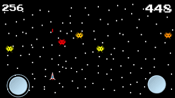

# Brainy-Aliens

[Brainy Aliens](https://apps.apple.com/jp/app/brainy-aliens/id1441222991?l=en) is a straightforward game where you have to shoot as many aliens as you can before the time runs out. The faster you shoot the aliens, the more points you will earn.

However, the aliens' colors will change by going through all the colors of the rainbow. The color red has the highest point value, while purple has the lowest point value. But, if an alien reaches the color pink, you will lose points.

Along with this, there is a catch: the aliens will get smarter at avoiding your bullets as the game progresses. This is due to a neural network/brain that evolves continuously in the game. As a result, the game gets harder.

Nonetheless, this game's purpose is to provide you a fun experience in shooting aliens and watching them get better.

 I made this during the beginning of my Sophomore year of high school (Fall 2018).

## RUN GAME LOCALLY

To run the game locally, download this project and run it in [Unity](https://unity.com/). 

## CONCEPTS

- Genetic Algorithms
- Neural Networks
- Sprite design

